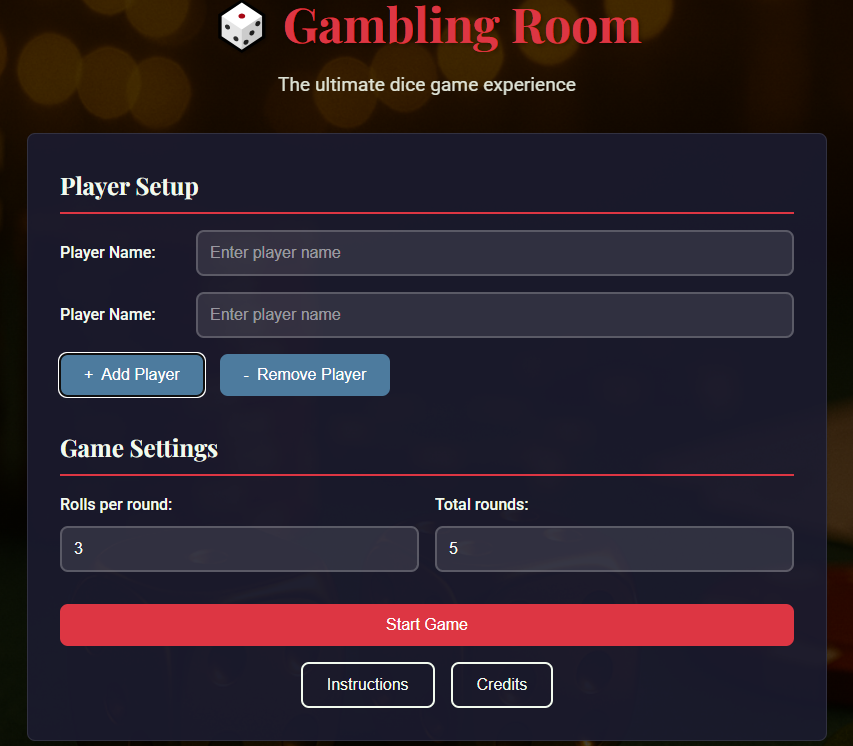
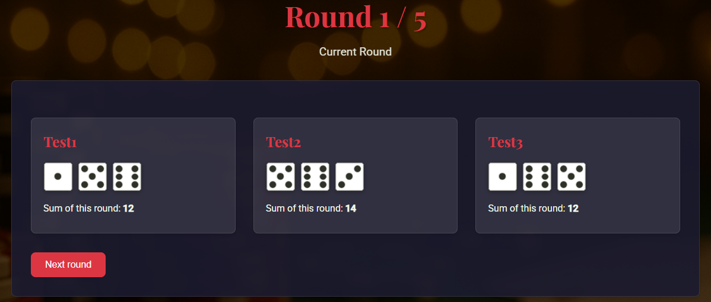

# 🎲 Gambling Room – Simulacija igre s kockami

**Gambling Room** je spletna aplikacija za simulacijo igre s kockami, kjer uporabniki vnesejo svoja imena, število metov na krog in število krogov, nato pa igra poteka krog za krogom z vizualizacijo rezultatov. Na koncu se izpiše zmagovalec z največjo skupno vsoto.

## 🔧 Funkcionalnosti
- Dinamičen vnos poljubnega števila igralcev
- Nastavitev števila metov in krogov
- Prikaz kock z uporabo animiranih `.gif` slik
- Interaktivna igra, ki napreduje krog za krogom
- Uporaba PHP sej za shranjevanje napredka igre
- SweetAlert pojavni okni za navodila in kredite

## 📦 Namestitev

### 1. Nastavitev strežniškega okolja
Prepričajte se, da imate nameščen spletni strežnik s podporo za PHP, npr.:
- [XAMPP](https://www.apachefriends.org/)
- [WampServer](http://www.wampserver.com/)
- [MAMP](https://www.mamp.info/)
- Nginx + PHP

### 2. Kopiranje datotek
Prenesite ali klonirajte ta repozitorij, nato pa kopirajte vse datoteke in mape v korensko mapo vašega spletnega strežnika (npr. `htdocs` pri XAMPP)

### 3. Zagon igre
Zaženite svoj lokalni strežnik in nato v brskalniku obiščite:

Takoj boste preusmerjeni na obrazec za vnos igralcev in lahko pričnete z igro.

## 📁 Struktura projekta

- `index.html` – začetna stran z obrazcem in UI
- `neki.php` – skripta za potek igre in izpis rezultatov
- `style.css` – celotna stilizacija strani
- `img/` – slike kock in ozadja
- SweetAlert – za prikaz navodil in kreditov

## 📸 Predogled

## 🧑‍💻 Avtorji
- Izdelal: **Filip Furlan**
- Leto: 2025

## ⚠️ Zahteve
- PHP 7.0 ali novejši
- Podpora za `$_SESSION`
- Sodobni brskalnik (Chrome, Firefox, Edge)

---